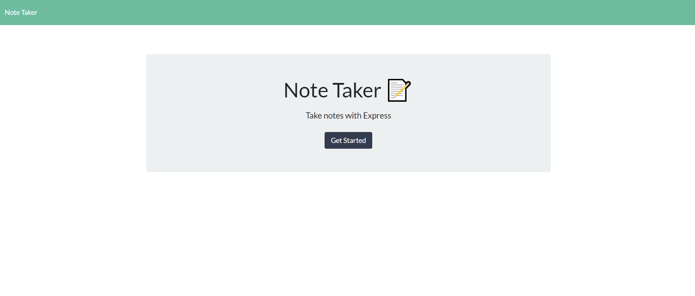
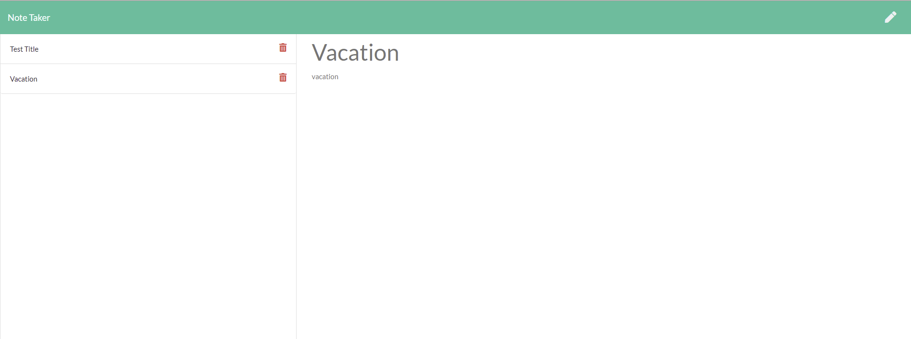

# Note Taker
Application can be used to write, save, and delete notes. This application  use an express backend that save and retrieve note data from a JSON file.

### Note Taker contents:
* [User Story](#User-Story)
* [Images with application functionality](#Images-with-application-functionality)
* [Tech/framework used](#Tech/framework-used)
* [Installation](#Installation)
* [Project Link & Repository](#Project-Link-&-Repository)
* [Contributors](#Contributors)
* [License](#License)

### User Story
```
AS A user, I want to be able to write and save notes
I WANT to be able to delete notes I've written before
SO THAT I can organize my thoughts and keep track of tasks I need to complete
```
### Images with application functionality:

|  |  |

### Tech/framework used:
* Node JS
* Express
* Heroku

### Installation  
* Copy repository on your local machine
* Create a `.gitignore` file and include `node_modules/` and `.DS_Store/` so that your `node_modules` directory isn't tracked or uploaded to GitHub. Be sure to create your `.gitignore` file before installing any npm dependencies.
* Run npm install  in your terminal to install all dependency
* Run npm start - to start the app
* Open localhost:8080 in your browser

### Project Link & Repository
- Heroku Link- (https://notetakerion.herokuapp.com/notes)
- Repository Link - (https://github.com/IonGavrilita/Note_Taker)

### Contributors
* Name: Ion Gavrilita
- Email: gavrilita.ion.93@gmail.com
- Github profile: https://github.com/IonGavrilita
### License
This project is licensed under MIT
[](https://opensource.org/licenses/MIT)

